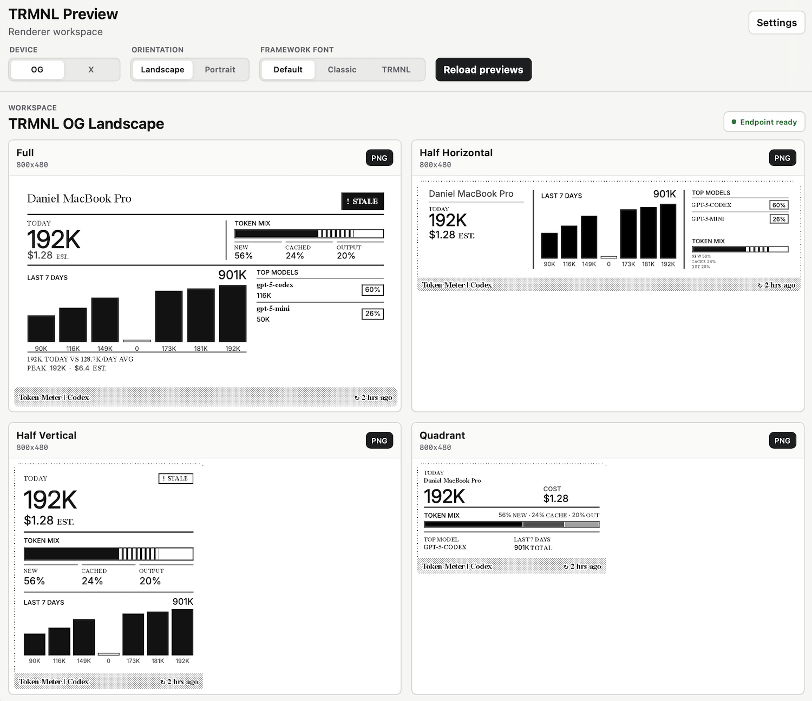

# TRMNL Preview Server

Preview third-party TRMNL plugin markup locally before it reaches a device.



The preview server connects to your plugin's `plugin_markup_url`, validates the
response, and renders all four TRMNL layout variants in a desktop workspace.
It is intended for plugin authors who already have a local or remote endpoint
that returns TRMNL markup JSON.

The tool runs entirely on your machine. It does not upload your markup,
credentials, diagnostics, screenshots, or plugin data to any preview service.
When you use the default local target mode, requests stay inside your local
development environment.

## Where This Fits

`trmnl-plugin-preview` is for [Third Party plugins](https://docs.trmnl.com/go/plugin-marketplace/introduction):
hosted endpoints that return TRMNL markup in response to a
`plugin_markup_url` request. If you're building a local Liquid-based
[Private Plugin](https://help.trmnl.com/en/articles/9510536-private-plugins)
or [Recipe](https://help.trmnl.com/en/articles/10122094-plugin-recipes)
project that lives inside TRMNL,
[trmnlp](https://github.com/usetrmnl/trmnlp) is the better fit.

## Quick Start

Start your plugin server first. Then run the preview server with the markup URL,
bearer token, and user UUID you want to test:

```bash
npx trmnl-plugin-preview \
  --target http://localhost:8787/trmnl/markup \
  --token local-preview-token \
  --user-uuid local-preview-user
```

The preview server launches your default browser automatically when it starts.
Use `--no-open` to keep it in terminal-only mode.

Open:

```text
http://127.0.0.1:4568
```

When you start the server with `--target`, `--token`, and `--user-uuid`, the
workspace opens directly after the endpoint diagnostics pass. If you start the
server without connection details, the first screen asks for them before the
workspace loads.

## Develop From Source

```bash
git clone https://github.com/danmunoz/trmnl-plugin-preview.git
cd trmnl-plugin-preview
pnpm install
pnpm run install:browsers
pnpm dev
```

To pass a target while running from source:

```bash
pnpm dev -- \
  --target http://localhost:8787/trmnl/markup \
  --token local-preview-token \
  --user-uuid local-preview-user
```

## What You Need

- Node.js `>=24 <26`
- A TRMNL plugin markup endpoint
- A bearer token accepted by that endpoint
- A user UUID for the preview request
- Chromium for PNG export, installed with `npx playwright install chromium`

By default, the target URL must be local: `localhost`, `127.0.0.1`, or `[::1]`.
This prevents the preview server from becoming a generic credential relay. To
test a remote endpoint that you control, start with `--allow-remote-targets`.
In that mode, the preview server sends your configured bearer token and preview
request to the remote URL you provide.

## What It Shows

The dashboard renders these four variants at once:

- full
- half horizontal
- half vertical
- quadrant

Controls let you switch between TRMNL OG and TRMNL X, landscape and portrait,
the TRMNL framework font modes, and live HTML or rendered PNG previews. Both
device models fit into the same 640-pixel preview stage while preserving their
native aspect ratios. Rendered HTML and PNG routes use the selected model's
physical device dimensions.

Endpoint diagnostics are available from the workspace status control. They show
the target host, HTTP status, response keys, and a redacted `curl` command.

## Common Options

```bash
trmnl-plugin-preview \
  --port 4568 \
  --target http://localhost:8787/trmnl/markup \
  --token local-preview-token \
  --user-uuid local-preview-user
```

To open the workspace from another device on your network, bind the server to
the exact address of the network interface you want to expose:

```bash
trmnl-plugin-preview --host 192.168.1.20 --port 4568 --no-open
```

Then open `http://192.168.1.20:4568` from the other device. Binding an exact
interface address limits the listener to that interface and allows PNG rendering
to call back into the same listener.

See [Configuration](./docs/configuration.md) for the full CLI and environment
variable reference.

## Troubleshooting

**The workspace does not open**  
The preview server validates your endpoint first. Check the error shown on the
first screen. The most common causes are wrong bearer token, wrong user UUID,
invalid JSON, or missing markup fields.

**Remote target rejected**  
Remote targets are disabled by default. Use `--allow-remote-targets` only for
endpoints you control.

**PNG previews fail**

Install Chromium with:

```bash
npx playwright install chromium
```

**Port already in use**  
Start on another port:

```bash
trmnl-plugin-preview --port 4569
```

## Reference

- [Endpoint contract](./docs/endpoint-contract.md)
- [Configuration](./docs/configuration.md)
- [HTTP routes](./docs/routes.md)
